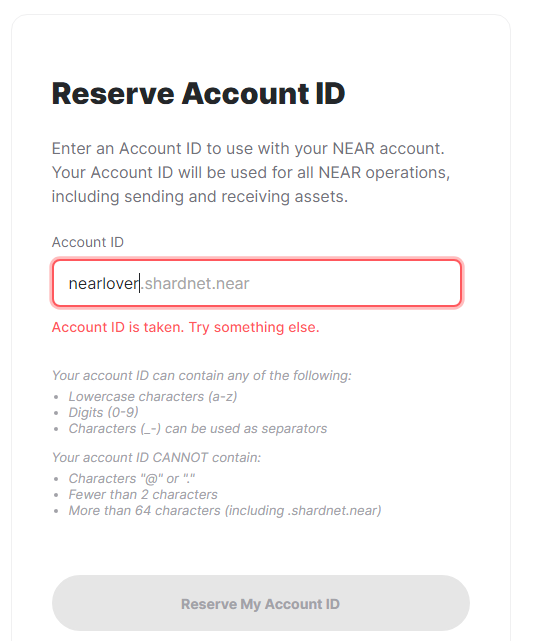
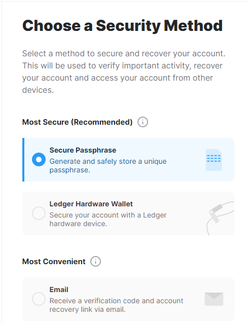
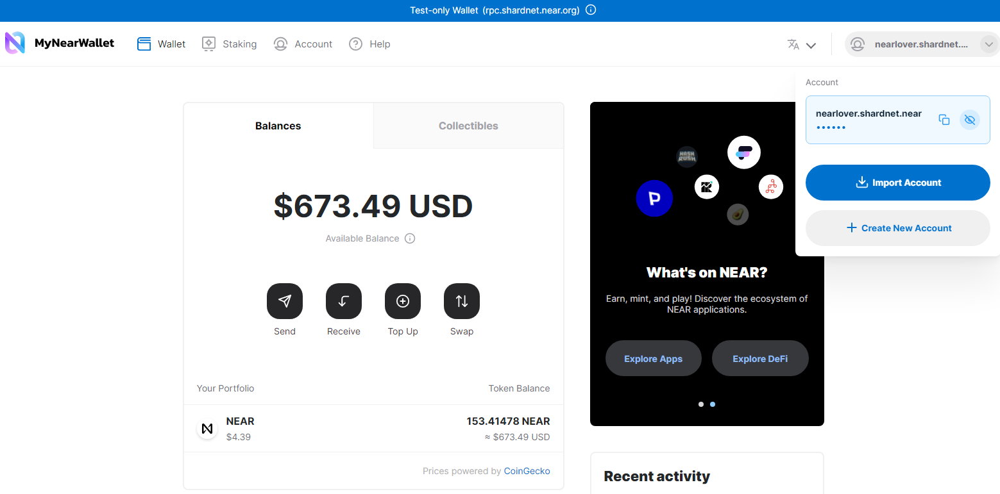
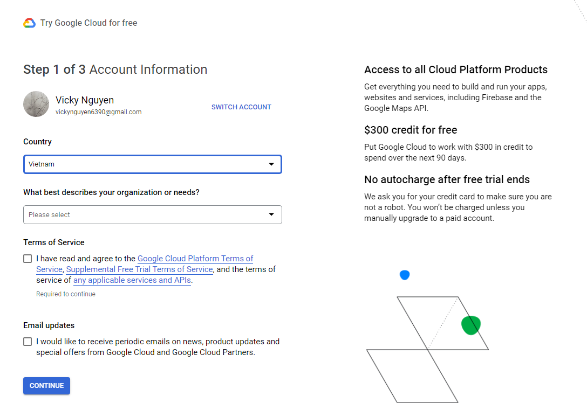
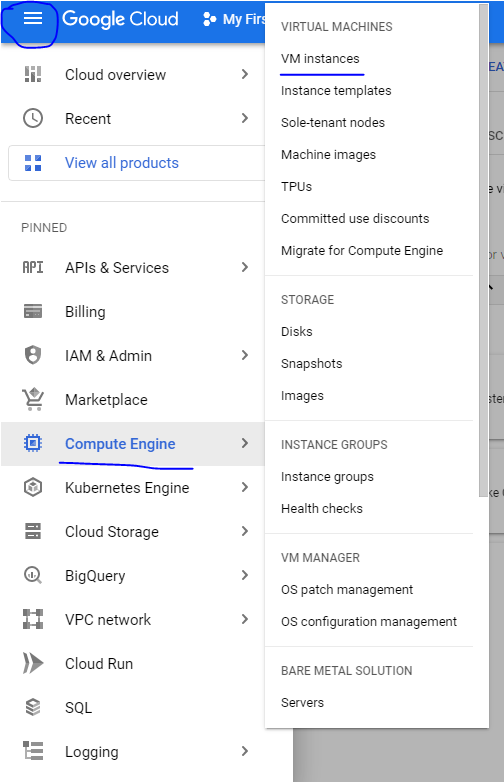
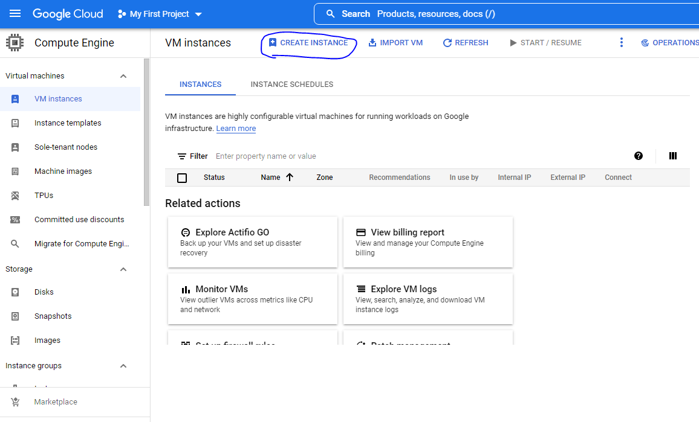
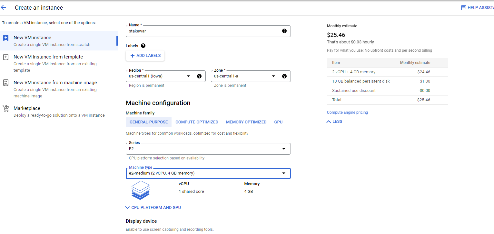
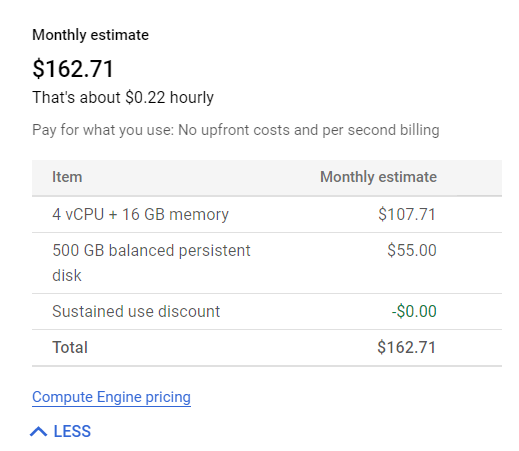
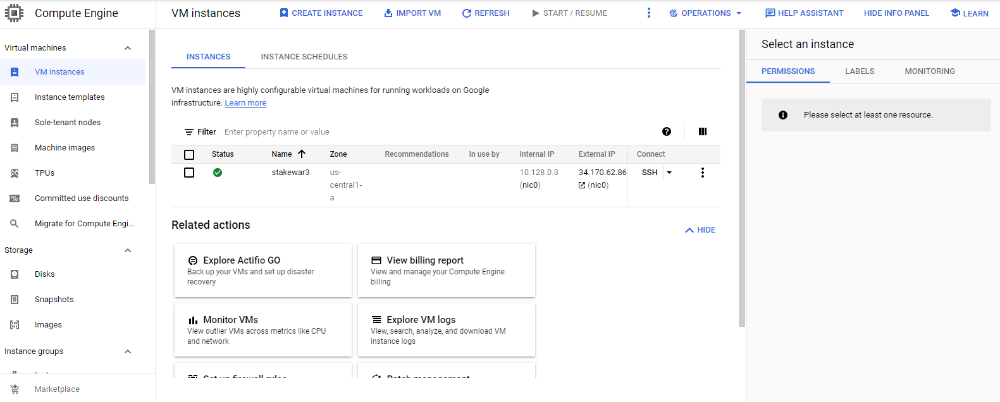

# Stake Wars: Episode III. Challenge 005
* Published on: 2022-07-23
* Updated on: 2022-07-23
* Submitted by: nearlover.factory.shardnet.near

# Setup a running validator node for shardnet on Google Cloud provider 


## Create a wallet

Visit https://wallet.shardnet.near.org/ and click “Create account”, then reserve your Account ID. 
※If you have existing account, you can skip this step.

 

and choose a security method among available options (Seed Phrase, Ledger, etc). 
I will choose Secure Passphrase for my wallet because it is the most recommended method.



> IMPORTANT! In case of choosing Seed Phrase make sure to write it down and keep in safe place!

After you are done you can log in to the wallet with the chosen method!



---


## Get a server

Please see the hardware requirement below:

| Hardware       | Chunk-Only Producer  Specifications                                   |
| -------------- | ---------------------------------------------------------------       |
| CPU            | 4-Core CPU with AVX support                                           |
| RAM            | 8GB DDR4                                                              |
| Storage        | 500GB SSD                                                             |

So, I will instruct you to create a VPS with similar hardware requirement above.

First, go to https://cloud.google.com/ and login with your google account.
After you login you will see this similar screen below.


Click "Get started for free" to get 300$ and 90 days free of use if you didn't use google cloud service before



> You will be notified to pay fee when the trial is finished. If you don't upgrade your account, you will not be able to use anymore.

After register free trial account, you click to the 三 icon on the top left page --> Compute Engine --> VM instances to access to VM list page and we will create new VPS there.



You create new instance by clicking to "CREATE INSTANCE"



Choose your configuration that fitting hardware requirement


Check the estimated price



Once operating system is installed you can view in in the VM list.



Open SSH terminal and ready for the main steps.


make sure the server is good for StakeWars and run this command in console: 

```
lscpu | grep -P '(?=.*avx )(?=.*sse4.2 )(?=.*cx16 )(?=.*popcnt )' > /dev/null \
  && echo "Supported" \
  || echo "Not supported"
```

If you see this output you should be fine!

```
 Supported
```
---


## Set up NEAR-CLI

In order to communicate with the NEAR blockchain via remote procedure calls (RPC) you should install NEAR-CLI.

Before you start make sure the Linux system is up-to-date:

```
sudo apt update && sudo apt upgrade -y
```

Then install developer tools such as `Node.js` and `npm`:

```
curl -sL https://deb.nodesource.com/setup_18.x | sudo -E bash -  
sudo apt install build-essential nodejs
PATH="$PATH"
```

Check `Node.js` and `npm` versions after:

```
node -v
```

> Should be v18 or higher.

```
npm -v
```

> Should be v8 or higher.

Now you you are all set and can install NEAR-CLI:

```
sudo npm install -g near-cli
```

Then you should set the environment variable to select the correct network:

```
export NEAR_ENV=shardnet
```

To make it persistent you should do this:

```
echo 'export NEAR_ENV=shardnet' >> ~/.bashrc
source ~/.bashrc
```


See below some NEAR-CLI commands' examples for your reference.

```
near proposals
```

This shows a list of proposals by validators indicating they would like to enter the validator set. For a proposal to be accepted it must meet the minimum seat price. See seat price [here](https://explorer.shardnet.near.org/nodes/validators).

```
near validators current
```
This shows a list of validators in the validator set currently, the number of expected and produced blocks and chunks, as well as online rate.

```
near validators next
```
This shows a list of validators with accepted proposals which will enter the validator set in the next epoch.

---

## Set up NEAR node

First of all install required developer tools:

```
sudo apt install -y git binutils-dev libcurl4-openssl-dev zlib1g-dev libdw-dev libiberty-dev cmake gcc g++ python docker.io protobuf-compiler libssl-dev pkg-config clang llvm cargo
```

Then install Python pip (the package installer for Python) and set the configuration:

```
sudo apt install python3-pip
USER_BASE_BIN=$(python3 -m site --user-base)/bin
export PATH="$USER_BASE_BIN:$PATH"
```

You will also have to install building environment:

```
sudo apt install clang build-essential make
```

Finally install Rust & Cargo:

```
curl --proto '=https' --tlsv1.2 -sSf https://sh.rustup.rs | sh
```
> Press 1 when asked during installation

And source the environment at the end:

```
source $HOME/.cargo/env
```

You are all set! Now it's time to clone `nearcore` repository from GitHub:

```
git clone https://github.com/near/nearcore
cd ~/nearcore
git fetch
git checkout <commit>
```
> You can always find the current version of commit number in [this file](https://github.com/near/stakewars-iii/blob/main/commit.md) 

And compile `nearcore` binary:

```
cargo build -p neard --release --features shardnet
```

Feel free to take a break because compiling `nearcore` binary can take some time!

When it's done you should initialize working directory and get a couple of required configuration files:

```
./target/release/neard --home ~/.near init --chain-id shardnet --download-genesis
```

As result you will end up with **config.json**, **node_key.json**, and **genesis.json** in **.near** directory. 
You should replace **config.json** though with the one having proper "boot_nodes" and "tracked_shards" values.

```
rm ~/.near/config.json
wget -O ~/.near/config.json https://s3-us-west-1.amazonaws.com/build.nearprotocol.com/nearcore-deploy/shardnet/config.json
```

You can start NEAR node simply running the following command:

```
cd ~/nearcore
./target/release/neard --home ~/.near run
```

However, in order to keep it running (and restart after a failure) you should set systemd script:

```
sudo tee <<EOF >/dev/null /etc/systemd/system/neard.service
[Unit]
Description=NEARd Daemon Service

[Service]
Type=simple
User=<USER_ID>
#Group=near
WorkingDirectory=/home/<USER_ID>/.near
ExecStart=/home/<USER_ID>/nearcore/target/release/neard run
Restart=on-failure
RestartSec=30
KillSignal=SIGINT
TimeoutStopSec=45
KillMode=mixed

[Install]
WantedBy=multi-user.target
EOF

sudo systemctl daemon-reload 
sudo systemctl enable neard
sudo systemctl start neard
```
> Make sure to update <USER_ID> accordingly

To see logs for your node you should run:

```
journalctl -n 100 -f -u neard
```
See below an example of log messages.

 

---

## Become a validator

You should run the following command to install full access key locally to sign transactions via NEAR-CLI:

```
near login
```

If you have GUI on the server then a web browser is going to open up. Otherwise, just copy link from the ouput to your browser

 

then grant access to NEAR-CLI in opened window

 

and after pressing Enter in the console you should get something like that.


You would need another configuration file **(validator_key.json)** so go ahead and create it!

```
near generate-key <pool_id>
```
> Feel free to replace pool_id with the pool name of your choice.

Then copy the generated key file to the validator directory:

```
cp ~/.near-credentials/shardnet/pool_id.json ~/.near/validator_key.json
```

Make the following changes in validator_key.json file:
* Set "xx.factory.shardnet.near" value (where xx is your pool name) to "account_id"
* Change "private_key" to "secret_key"

> Note: The account_id must match the staking pool contract's name you will create further!

File content should look like that at the end:
```
{
  "account_id": "xx.factory.shardnet.near",
  "public_key": "ed25519:****",
  "secret_key": "ed25519:****"
}
```

Now proceed with deploying staking pool and integrating it into a previously created node. In order to do this you should run:

```
near call factory.shardnet.near create_staking_pool '{"staking_pool_id": "<pool id>", "owner_id": "<accountId>", "stake_public_key": "<public key>", "reward_fee_fraction": {"numerator": 5, "denominator": 100}, "code_hash":"DD428g9eqLL8fWUxv8QSpVFzyHi1Qd16P8ephYCTmMSZ"}' --accountId="<accountId>" --amount=30 --gas=300000000000000
```

where "pool id" is the name of pool you created, "accountId" is your Near wallet name and "public key" can be found in **validator_key.json** file stored in **.near** directory.

> Note: You should have at least 30 NEAR available on your Near wallet's balance.

You would wanna see something like that as a result.


Congratulations! You finished a configuration of your staking pool so should be able to see it [the list of validators](https://explorer.shardnet.near.org/nodes/validators).

It should also appear in near proposals. 


Last but not least you should top up the balance of your pool to meet the minimum seat price (check it [here](https://explorer.shardnet.near.org/nodes/validators)).

```
near call <staking_pool_id> deposit_and_stake --amount <amount> --accountId <accountId> --gas=300000000000000
```

You can always check total and staked balance of you pool by running these commands:

##### Total Balance
```
near view <staking_pool_id> get_account_total_balance '{"account_id": "<accountId>"}'
```

##### Staked Balance
```
near view <staking_pool_id> get_account_staked_balance '{"account_id": "<accountId>"}'
```

If you decide to unstake and withdraw some or all tokens you should run:

##### Unstake NEAR
```
near call <staking_pool_id> unstake '{"amount": "<amount yoctoNEAR>"}' --accountId <accountId> --gas=300000000000000
```

To unstake all you can run this command instead:
```
near call <staking_pool_id> unstake_all --accountId <accountId> --gas=300000000000000
```

##### Withdraw

After 2-3 epochs after unstaking you can withdraw from the pool:

```
near call <staking_pool_id> withdraw '{"amount": "<amount yoctoNEAR>"}' --accountId <accountId> --gas=300000000000000
```

To withdraw all you can run this command instead:
```
near call <staking_pool_id> withdraw_all --accountId <accountId> --gas=300000000000000
```

> Unlike stake command amount in unstake and withdraw ones should be in yoctoNEAR (1 NEAR = 100,000,000 yoctoNEAR).

You can check unstaked and available for withdrawal balance of you pool this way:

##### Unstaked Balance
```
near view <staking_pool_id> get_account_unstaked_balance '{"account_id": "<accountId>"}'
```

##### Available for Withdrawal
```
near view <staking_pool_id> is_account_unstaked_balance_available '{"account_id": "<accountId>"}'
```
> It should be unlocked for you to be able to withdraw funds.

It's worth also mentioning that it's possible to pause staking:

```
near call <staking_pool_id> pause_staking '{}' --accountId <accountId>
```

and resume it later:

```
near call <staking_pool_id> resume_staking '{}' --accountId <accountId>
```

---

## Set up regular ping

In order to stay in the validator set you should peridically ping staking pool conract. Ping issues a new proposal and updates the staking balances and should happen at least once at epoch.

You can do this manually:

```
near call <staking_pool_id> ping '{}' --accountId <accountId> --gas=300000000000000
```

Alternatively, you can set up cron job to automate the process.

Create **ping.sh** file in **/home/<USER_ID>/scripts/** directory with the following content:

```
#!/bin/sh
# Ping call to renew Proposal added to crontab

export NEAR_ENV=shardnet
export LOGS=/home/<USER_ID>/logs
export POOLID=<YOUR_POOL_ID>
export ACCOUNTID=<YOUR_ACCOUNT_ID>

echo "---" >> $LOGS/all.log
date >> $LOGS/all.log
near call $POOLID.factory.shardnet.near ping '{}' --accountId $ACCOUNTID.shardnet.near --gas=300000000000000 >> $LOGS/all.log
near proposals | grep $POOLID >> $LOGS/all.log
near validators current | grep $POOLID >> $LOGS/all.log
near validators next | grep $POOLID >> $LOGS/all.log
EOF
```

> Make sure to replace <USER_ID>, <YOUR_POOL_ID> and <YOUR_ACCOUNT_ID> accordingly.

And then create crontab job which is going to be running that script:

```
crontab -e
*/5 * * * * sh /home/<USER_ID>/scripts/ping.sh
```

You can check if job was created by reviewing a user's crontab:

```
crontab -l
```

and see log messages too:

```
cat home/<USER_ID>/logs/all.log
```

as well as transactions in Recent Activity of Near wallet.


---

